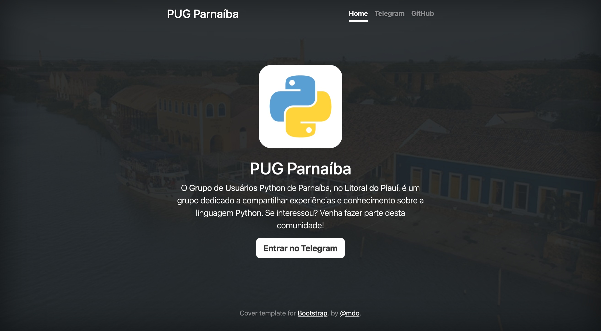

# Site do PUG Parnaíba

### Quais os próximos passos?

- Construir um mini blog
- Criar uma página de "sobre"
- Melhorar o design do site
- Algo que você ache legal 😉

### Como posso fazer?

- Crie [**issues**](https://github.com/pugphb/pugphb.github.io/issues) para os itens à melhorar
- Faça um [**fork**](https://github.com/pugphb/pugphb.github.io/fork) deste repositório e tente desenvolver algum desses itens
- Submeta um [**pull request**](https://github.com/pugphb/pugphb.github.io/pulls) das suas implementações

Boa sorte! 😄